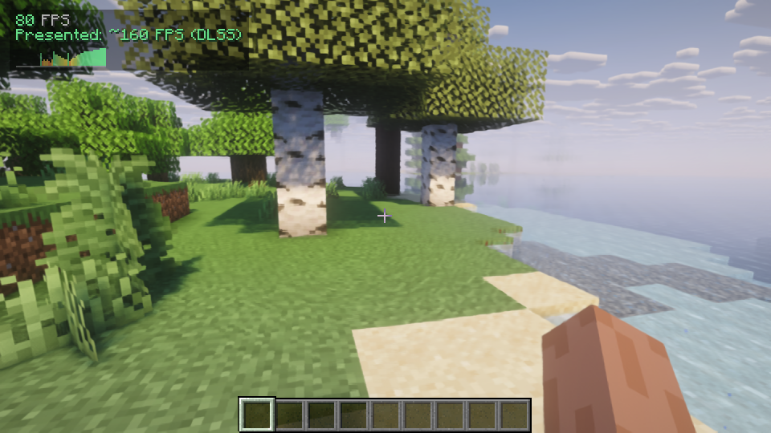

<div align="center">

# PureScale Modern

**Native upscaling and frame generation for Minecraft.**

[](#pick-your-build)
[](#pick-your-build)
[](CHANGELOG.md)

[Downloads](https://github.com/xsoras/purescale/releases/latest) · [Discord](https://discord.gg/XgH4EpyPD2) · [Video](https://www.youtube.com/watch?v=xIIHwB45ZEw)

</div>

PureScale renders the world at a lower resolution and rebuilds it at your screen resolution. The HUD and menus stay native, so saving GPU work doesn't mean putting up with blurry inventory text.

Modern adds DLSS Super Resolution, DLSS Frame Generation and FSR 4.1 alongside PureScale's built-in upscalers. It runs directly with the mod and its native runtimes. No ReShade setup.

Start with Quality and see how it feels. There are plenty of settings if you want to spend an afternoon on it, but you can also pick a mode and just play.

## Pick your build

| Minecraft | Fabric | NeoForge | Required renderer |
| --- | --- | --- | --- |
| 1.20.1 | [Fabric](mods/fabric/purescale-modern-fabric-mc1.20.1-1.2-modern-dev.jar) | [NeoForge](mods/neoforge/purescale-modern-neoforge-mc1.20.1-1.2-modern-dev.jar) | Sodium / Embeddium |
| 1.21.1 | [Fabric](mods/fabric/purescale-modern-fabric-mc1.21.1-1.2-modern-dev.jar) | [NeoForge](mods/neoforge/purescale-modern-neoforge-mc1.21.1-1.2-modern-dev.jar) | Sodium |
| 1.21.11 | [Fabric](mods/fabric/purescale-modern-fabric-mc1.21.11-1.2-modern-dev.jar) | [NeoForge](mods/neoforge/purescale-modern-neoforge-mc1.21.11-1.2-modern-dev.jar) | Sodium |
| 26.1.x | [Fabric](mods/fabric/purescale-modern-fabric-mc26.1.x-1.2-modern-dev.jar) | [NeoForge](mods/neoforge/purescale-modern-neoforge-mc26.1.x-1.2-modern-dev.jar) | Sodium |
| 26.2 | [Fabric](mods/fabric/purescale-modern-fabric-mc26.2-1.2-modern-dev.jar) | [NeoForge](mods/neoforge/purescale-modern-neoforge-mc26.2-1.2-modern-dev.jar) | Sodium |
| 26.3 | [Fabric](mods/fabric/purescale-modern-fabric-mc26.3-1.2-modern-dev.jar) | [NeoForge](mods/neoforge/purescale-modern-neoforge-mc26.3-1.2-modern-dev.jar) | Sodium |

Fabric needs Fabric API and Sodium. NeoForge needs Sodium from 1.21.1 onward. For 1.20.1, use Embeddium on NeoForge; that build uses the original Forge namespace and Forge-compatible metadata.

The 26.1.x builds accept the 26.1 series and were compiled and tested on 26.1.2. Use Java 17 for 1.20.1, Java 21 for 1.21.x, and Java 25 for 26.x. Install one PureScale edition per instance.

## Install

1. Pick the JAR that matches your Minecraft version and loader. Put that file in your instance's `mods` folder.
2. Add the required renderer from the table. Fabric also needs Fabric API.
3. Start the game and press **F9** to open PureScale's settings.
4. Pick your upscaler. If a native mode shows **Get**, use it to install the matching runtime, then restart the game.

For manual setup, download a runtime package from [Releases](https://github.com/xsoras/purescale/releases/latest) and extract it into `purescale_natives` inside the game instance. The full Windows package already includes that folder. Keep its subfolders as they are.

```text
your-game-instance/
  mods/
    purescale-modern-<loader>-mc<version>-1.2-modern-dev.jar
  purescale_natives/
    native DLLs
    dlssgl/
    dlssg/
```

## What works where

| Feature | What it needs |
| --- | --- |
| Built-in upscalers | No vendor runtime. Available modes vary by Minecraft version. |
| DLSS Super Resolution / DLAA | Supported NVIDIA RTX GPU and the DLSS runtime |
| DLSS Frame Generation | Compatible NVIDIA GPU, driver and FG runtime |
| FSR 4.1 | Supported Radeon GPU and the FSR runtime |
| Experimental Neural Rendering | Optional original runtime, installed manually |

The native packages here are for **Windows x64**. DLSS SR and FG can run on OpenGL with shaders; Vulkan integration is also present on 26.2 and 26.3. Older Minecraft versions have a smaller selection of PureScale's own temporal modes.

Frame generation feels best with a steady base frame rate. The overlay shows rendered FPS first and labels the presented estimate separately, so you can see what the game is actually doing.

## With shaders

Iris works with the Fabric builds. Here's 1.20.1 with Complementary Reimagined, DLSS SR and 2x DLSS FG:



The six targets were opened and checked on an RTX 5070, including native SR evaluations, actual 2x/4x FG presentations, settings and the main Off switch. The final 1.20.1 shader test also checked the FPS overlay and its text.

I haven't validated FSR 4.1 output on a Radeon yet. Its unsupported-GPU fallback was checked on NVIDIA hardware. Shader packs also vary, so a working Complementary setup doesn't promise that every pack will behave the same way.

Neural Rendering is still experimental. The controls and adapter are included, but the original runtime isn't distributed here or downloaded by Get. It is not a completed integration through a public DLSS 5 SDK.

## If something looks wrong

Check the Minecraft version, loader and renderer first. For a native mode, check that the DLL folder is in the same instance you're launching. Restart after installing a runtime.

For shader issues, try the same scene without the pack once. If it still happens, send the game version, loader, GPU, driver, PureScale settings and the relevant log. A screenshot of the settings helps more than trying to guess what was enabled.

## License

PureScale's original work is covered by [CC0 1.0](LICENSE.md). NVIDIA and AMD runtimes keep their own licenses. The full notices are in [licenses](licenses), with a file overview in [Third-party notices](THIRD-PARTY-NOTICES.md).
